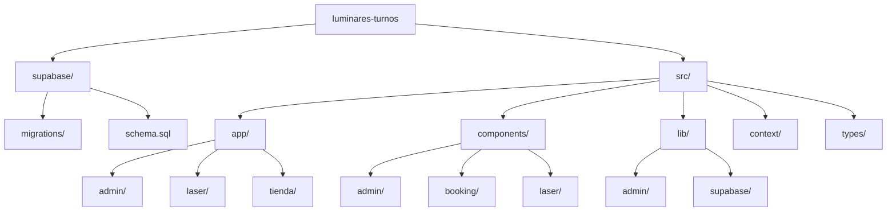

# 🗺️ Esquema y Arquitectura del Proyecto



---

## 📁 Árbol Completo de Archivos

```text
luminares-turnos/
├── .cursor/rules
├── .next/
├── node_modules/
├── public/
├── src/
│   ├── app/
│   │   ├── admin/
│   │   │   ├── login/
│   │   │   │   └── page.tsx
│   │   │   ├── tienda/
│   │   │   │   ├── components/
│   │   │   │   └── page.tsx
│   │   │   └── page.tsx
│   │   ├── api/
│   │   │   └── auth/
│   │   │       └── logout/
│   │   │           └── route.ts
│   │   ├── faq/
│   │   │   └── page.tsx
│   │   ├── fonts/
│   │   │   ├── GeistMonoVF.woff
│   │   │   └── GeistVF.woff
│   │   ├── laser/
│   │   │   ├── agenda/
│   │   │   │   └── page.tsx
│   │   │   └── page.tsx
│   │   ├── mis-turnos/
│   │   │   └── page.tsx
│   │   ├── servicios/
│   │   │   └── page.tsx
│   │   ├── tienda/
│   │   │   ├── components/
│   │   │   │   ├── CarritoModal.tsx
│   │   │   │   └── ProductoCard.tsx
│   │   │   └── page.tsx
│   │   ├── declarations.d.ts
│   │   ├── favicon.ico
│   │   ├── globals.css
│   │   ├── layout.tsx
│   │   └── page.tsx
│   ├── components/
│   │   ├── admin/
│   │   │   ├── modals/
│   │   │   │   ├── ModalCobro.tsx
│   │   │   │   ├── ModalEditarTurno.tsx
│   │   │   │   ├── ModalNuevoTurno.tsx
│   │   │   │   ├── ModalPromo.tsx
│   │   │   │   ├── ModalServicioGeneral.tsx
│   │   │   │   └── ModalServicioLaser.tsx
│   │   │   ├── tabs/
│   │   │   │   ├── AgendaTab.tsx
│   │   │   │   ├── BannerTab.tsx
│   │   │   │   ├── FaqTab.tsx
│   │   │   │   ├── GeneralesTab.tsx
│   │   │   │   ├── HorariosTab.tsx
│   │   │   │   ├── OverviewTab.tsx
│   │   │   │   ├── PreciosTab.tsx
│   │   │   │   └── ReferidosTab.tsx
│   │   │   ├── AdminHeader.tsx
│   │   │   ├── AdminTabs.tsx
│   │   │   ├── AgendaPanel.tsx
│   │   │   ├── DashboardOverview.tsx
│   │   │   ├── ModalEditarReserva.tsx
│   │   │   ├── ResumenAgenda.tsx
│   │   │   └── types.ts
│   │   ├── booking/
│   │   │   ├── FlujoAgendaConfirmacion.tsx
│   │   │   ├── FormConfirmacion.tsx
│   │   │   ├── SelectorFecha.tsx
│   │   │   └── SelectorHorario.tsx
│   │   ├── home/
│   │   │   └── SeccionFAQ.tsx
│   │   ├── laser/
│   │   │   ├── BannerSugerenciaPromo.tsx
│   │   │   ├── BarraFlotanteLaser.tsx
│   │   │   ├── ModalSwapZona.tsx
│   │   │   ├── PanelPromos.tsx
│   │   │   ├── PanelZonasExtra.tsx
│   │   │   ├── PanelZonasIndividuales.tsx
│   │   │   ├── SelectorGenero.tsx
│   │   │   └── SelectorModoLaser.tsx
│   │   ├── BannerPrincipal.tsx
│   │   ├── CarritoDrawer.tsx
│   │   ├── footer.tsx
│   │   ├── ProductoCard.tsx
│   │   └── WhatsAppButton.tsx
│   ├── context/
│   │   └── CarritoContext.tsx
│   ├── lib/
│   │   ├── admin/
│   │   │   ├── constants.ts
│   │   │   ├── helpers.ts
│   │   │   ├── metricas.ts
│   │   │   └── validacion.ts
│   │   ├── booking/
│   │   │   ├── detalle.ts
│   │   │   └── session.ts
│   │   ├── calendario/
│   │   │   └── slots.ts
│   │   ├── laser/
│   │   │   └── calculos.ts
│   │   └── supabase/
│   │       ├── admin/
│   │       │   ├── cierres.ts
│   │       │   └── reservas.ts
│   │       ├── banner.ts
│   │       ├── configuracion.ts
│   │       ├── laser.ts
│   │       ├── reservas.ts
│   │       └── servicios-generales.ts
│   │   ├── supabase.ts
│   │   ├── types.ts
│   │   └── whatsapp.ts
│   ├── types/
│   │   └── tienda.ts
│   └── middleware.ts
├── supabase/
│   ├── migrations/
│   │   └── 002_admin_panel.sql
│   └── schema.sql
├── .env.local
├── .eslintrc.json
├── .gitignore
├── next-env.d.ts
├── next.config.mjs
├── package-lock.json
├── package.json
├── postcss.config.mjs
├── README.md
├── tailwind.config.ts
└── tsconfig.json
```